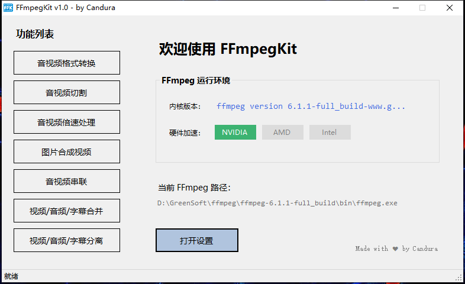

# FFmpegKit 🚀

**FFmpegKit** 是一款基于 C# + WinForms 开发的极简音视频处理小工具。它旨在提供一个轻量级、高兼容性且支持硬件加速的 FFmpeg 图形化前端界面。

---

## 🌟 项目亮点

* **极度轻量**：主程序体积仅约 **120kb**，绿色免安装。
* **硬核兼容**：基于 **.NET Framework 3.5** 编写，完美支持从 Windows XP 到 Windows 11 的所有主流系统。
* **智能加速**：自动检测 FFmpeg 内核对 **NVIDIA (NVENC)**、**Intel (QSV)**、**AMD (AMF)** 的支持情况，并根据环境动态调整 UI 选项。
* **逻辑严密**：内置环境自检与参数联动，有效防止因硬件不支持或参数冲突导致的转码失败。

---

## 🛠️ 核心功能

1.  **音视频格式转换**：支持主流封装格式（MP4/MKV/MP3/M4A等）互转，内置多种编码器预设。
2.  **音视频切割**：支持通过时间戳进行毫秒级精确切割。
3.  **倍速处理**：支持视频与音频的同步变速（0.25x - 4.0x）处理。
4.  **图片合成视频**：支持将静态图片帧快速转化为视频。
5.  **音视频串联**：
    * **快速模式**：针对相同规格文件（如 .ts 切片）实现无损合并。
    * **标准模式**：通过标准化重编码技术，解决不同分辨率、帧率素材的拼接难题。
6.  **多轨道合并**：支持视频、音频、外部字幕的多轨封装。
7.  **流提取分离**：一键提取视频流、背景音乐或外部字幕文件。

---

## 🚀 快速开始

1.  **准备内核**：下载好 `ffmpeg.exe` ，可以放置在程序根目录下（程序初次启动时优先自动检测），也可以放置在其他目录进入程序后手动选择位置。
2.  **运行程序**：双击运行 `FFmpegKit.exe`。
3.  **自动配置**：程序启动时会执行环境扫描，并在检测到 `ffmpeg.exe` 后主动识别判断当前硬件环境的加速能力。
4.  **开始处理**：选择功能 -> 拖入文件 -> 点击“开始”。

---

## 📝 技术细节与注意事项

### ffmpeg 版本与显卡驱动兼容性
对于使用老架构显卡的电脑，由于无法安装最新的显卡启动，高版本的 ffmpeg 未必能直接支持。

（比如我的老显卡在高版本ffmpeg中无法通过 `-hwaccel auto` 或 `-hwaccel cuda` 来解码，只能用低版本的ffmpeg调用 `-hwaccel cuvid`）

此时需要对照确认您选择的 ffmpeg 版本与显卡兼容性。

> ⚠️ **注意**：我打包的 `FFmpegKit_with_ffmpeg` 中内置的 `ffmpeg.exe` 版本为 `6.1.1-full_build-www.gyan.dev`

### 硬件加速逻辑
程序通过 `-encoders` 指令动态分析：
* 若全局设置关闭了 GPU 加速，相关 UI 选项将自动置灰并引导至软解。
* 优先尝试硬件解码，可能实现全链路加速（解码+编码）。

### 关于“快速模式”串联
在音视频串联功能中，**快速模式**采用 `Stream Copy` 技术：
> ⚠️ **注意**：该模式要求所有输入素材的分辨率、帧率及编码参数一致（例如合并从同一源下载的 TS 段）。若素材规格不一，可能无法生成文件或生成的文件无法播放，此时请使用“标准模式”以确保播放兼容性。

---

## 🤝 贡献与反馈

个人作品难免有考虑不周之处，欢迎开发者提交代码共同完善功能。
如果你在运行过程中遇到问题，欢迎查阅程序自动生成的日志文件（位于 `Logs/` 目录），并提交反馈。

---

## 📝 开发信息
- **运行环境**：.NET Framework 3.5 (兼容 Win7/10/11)
- **作者**：by Candura
- **版本**：2026.03 Stable
- **开源协议**：GPL v3.0

## **FFmpegKit - 让音视频处理重回轻盈 🚀**